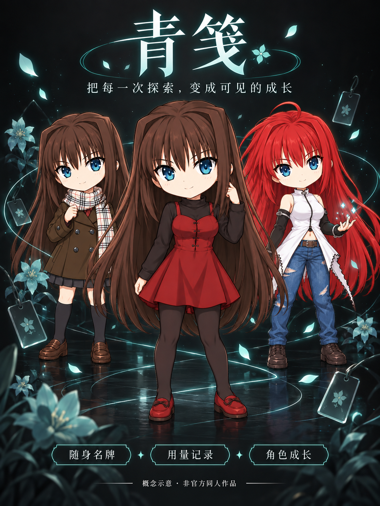

**English** · [简体中文](README.zh_CN.md)

# Qingjian · A wearable badge that grows with your AI work

[](https://github.com/007xf/qingjian-ai-passport/actions/workflows/static-checks.yml?query=branch%3Amain)
[](https://github.com/007xf/qingjian-ai-passport/actions/workflows/firmware-checks.yml?query=branch%3Amain)

These badges show the latest checks on the main branch. Open a badge to see its actual result and logs.

Qingjian combines a personal badge, three evolving character forms, AI usage dashboards and a classic Dino game. Edit your identity and pictures on your Mac, then take your badge with you.



This is an independent community project developed with AI assistance. It is not an official FoloToy, OpenAI, Cursor, Google or TYPE-MOON product.

- [Download the Mac app, firmware and checksums](https://github.com/007xf/qingjian-ai-passport/releases/tag/v1.4.0)
- [Source and issues](https://github.com/007xf/qingjian-ai-passport)
- [AI Passport community play 328](https://ai-passport.folotoy.cn/plays/328/). The previously approved release is public. Community review of a new version is separate from its GitHub release; check the version offered by the community before installing.
- Version: **1.4.0, Mac build 12 — community preview**.

## New in 1.4.0

- A background sync service keeps the selected badge connected after the editor quits, reconnects automatically and starts with the Mac user session once enabled.
- Quiet automatic refresh defaults to once a minute, with an hourly option and immediate manual Sync. Connection checks run about every 30 seconds; unchanged UI values are not repeatedly republished.
- Growth combines real Codex current-cycle Tokens with real Cursor billing-month Tokens. Each source retains its own reset period.
- Expired quota percentages remain visible as last readings with their original update time. Codex's native command is found even when its app has been renamed.
- Battery initialization recovers a known blank cold-start gauge state without replacing existing nonempty battery parameters.
- Character Workshop adds a reusable character-creation skill and editable prompts for making your own three-stage artwork, then importing it through the existing USB image workflow.

See the [background sync guide](docs/qingjian-background-sync.md) for setup, accounting rules and power-management limits.

## Compatibility and installation

The bundled Mac app targets **Apple Silicon, macOS 14 or later**. Python, image conversion, serial and Bluetooth dependencies are included. Intel Macs and other platforms are not supported by this build. Moving the bundle and using an empty user profile have been tested on the development Mac; this does not represent physical testing of every supported macOS release or account type.

The app has an ad-hoc integrity signature, **not a Developer ID signature or Apple notarization**. After verifying the download and checksum, follow [Apple's instructions](https://support.apple.com/102445) if macOS blocks the initial launch. Do not disable Gatekeeper globally. Investigate a damaged-file or malware warning instead of bypassing it blindly.

Download and unzip the complete app, move the extracted app bundle to Applications, and open it. Choose USB in Connection Settings, connect a powered-on badge using a data-capable cable, then verify the battery and time. Changes to your profile, feature selection and pictures require Upload to Badge; Save Draft only saves on that Mac. Existing badge settings and local drafts are retained.

**When upgrading:** disable Background Sync in the existing app before replacing it or flashing firmware, then quit the editor and close other serial clients. Quitting the editor alone does not stop an enabled background service or release its device connection. Replace the complete app bundle, open it from Applications, and re-enable Background Sync. Follow normal macOS Bluetooth or background-item permission prompts if shown, then confirm the connection and last sync time. Do not copy just the executable or delete your settings directory to upgrade.

## Firmware files: choose the correct address

This firmware targets the compatible ESP32-C3, 8 MB AI Passport layout. Back up your own device before installation and keep its private recovery link private.

- `qingjian-1.4.0-full.bin` is a **merged image for address 0x0**, including the bootloader, partition table and application. This is the community installer artifact. It may replace application settings even when chip erase is disabled.
- `qingjian-1.4.0-app.bin` is an **application-only image for address 0x10000**, for an already compatible layout. Never flash this file at address zero.
- Neither release file contains a device Flash dump, card identity or pairing secrets. Both end before the protected identity region. Never enable a whole-chip erase or overwrite the identity/recovery regions. Do not use an image on an unknown layout or modified board.
- Close serial clients before flashing and keep the cable connected. Use the [official installation tools](https://ai-passport.folotoy.cn/tools/web-flasher/) and your own [factory recovery instructions](https://ai-passport.folotoy.cn/guides/restore-factory-firmware/).

## First-launch preset and daily use

New profiles use Aoko Aozaki, the title `MISS BLUE`, the Chinese introduction shown in the product preview, and thresholds **77,777,777 / 555,555,555**. Codex, Cursor, Agents and Dino are selected; Gemini remains available but is not selected. The winter-scarf, red-dress and red-haired forms use the previously selected artwork. Initial usage is unknown until real data is read: no author account or example Token count is included.

Edit each of the three pictures and both thresholds independently. The Mac's Clear Preview uses the original picture; Device Pixels shows the actual converted artwork. Built-in art uses native 160×160 RGB565 pixels without an intermediate 128-pixel upscale. Custom pictures retain the compatible compressed codec and may have less detail.

**All picture changes, including restoring defaults, require USB.** The Mac keeps three originals, while the badge caches one custom form. Switching to another custom form requires USB synchronization. Bluetooth continues to synchronize text, settings, time, usage and activity; a Pending USB message does not mean a picture was uploaded.

Enable Background Sync after selecting and pairing your badge. The service continues after the editor quits and starts when this Mac user signs in. Automatic usage sync defaults to about once a minute; choose once an hour for fewer source refreshes, or press Sync when needed. Connection checks still run about every 30 seconds. Automatic sync sends saved usage, activity and time; it does not upload unfinished profile edits or pictures.

The optional Continue While Display Is Off setting prevents automatic idle system sleep while the badge is connected. It allows the display to turn off, but can increase power use. After a disconnect lasting 90 seconds, it releases that request; reconnecting restores it. Manual Sleep, closed-lid sleep, shutdown and logout can still stop synchronization. The service resumes attempts when the Mac can run again. Long-term battery-life improvement has not been measured. Saved badge content and Dino remain available offline; a cold boot needs time synchronization.

## Character Workshop: make your own three forms

The [Character Workshop skill](skills/qingjian-character-creator/SKILL.md), named `qingjian-character-creator`, and its [editable prompt templates](skills/qingjian-character-creator/references/character-prompts.md) are included in the GitHub source. You can keep Aoko, choose another character or design an original one; the three stage pictures and evolution thresholds remain independently editable in Qingjian.

1. Download [qingjian-character-creator.zip](https://github.com/007xf/qingjian-ai-passport/releases/download/v1.4.0/qingjian-character-creator.zip). Extract its `qingjian-character-creator` folder into `~/.codex/skills/`, so the entry file is `~/.codex/skills/qingjian-character-creator/SKILL.md`. Keep any existing customized copy before replacing it.
2. Start a new Codex session and invoke `$qingjian-character-creator`. Provide your own reference pictures, the traits to preserve, and the desired changes across the three stages. For example:

   ```text
   $qingjian-character-creator
   Use my attached references to create three full-body badge forms: everyday,
   evolved and final. Keep the approved face and proportions, use a natural
   stance and transparent backgrounds, and export each form as a separate PNG.
   ```

3. Inspect the resulting three PNGs for transparent backgrounds, complete limbs and consistent character details. In Qingjian, choose each picture under its matching stage, adjust the two Token thresholds if desired, and compare Clear Preview with Device Pixels.
4. Connect by **USB** and use Upload to Badge. Picture creation does not upload anything by itself. The device still caches one custom stage image, so another custom form may need its next USB update.

The skill guides a capable AI client through the artwork process; it does not add image generation to the badge or the Qingjian editor. New generation or editing requires an available image tool, and the result still needs review and may need revisions. If no image tool is available, import existing PNGs you provide, or use the editable prompts in a tool you already have. Use reference images and characters only within the rights you hold; the source-code license does not grant third-party character rights.

## Connect your own AI tools

**Codex:** Sign in to the local Codex app or a compatible CLI. Qingjian locates the native command by the application's identity, including a renamed installation, and reads its available quota windows separately from this Mac's accessible Token logs. Input already includes cached input; output is added, with cumulative-event and inherited-fork deduplication. These counts are not a bill or a cross-device account total. Account changes and separate `CODEX_HOME` profiles are isolated. Codex counting follows its weekly quota reset; after actually using a reset card, confirm that event in Qingjian. This resets only Codex's counting period, leaving Cursor's month intact. Qingjian never redeems or buys a reset card.

**Cursor:** Sign in to the standard local Cursor app and choose Refresh Usage. The two bars show **used**, not remaining, percentages for Cursor Models and Other Models, plus the billing reset. Qingjian also reads the account's actual Token aggregate from the start of its billing month to the observation time: uncached input + output + cache write + cache read. Group totals are checked, not added twice; quota percentages are never converted into Tokens. The collector uses the current client's internal read-only service, rather than a public stable API. Upstream changes, custom user-data directories or alternative builds can require an update. No model task, plan change or on-demand spending change is made. Each Mac reads its user's own login and stores no copied credentials.

**Growth = Codex current-cycle Tokens + Cursor current billing-month Tokens.** A billing month need not start on the first calendar day. A confirmed reset of either source can reduce the sum and change the character's stage. The two sources have separate observation times; cached input can be counted again in separate model calls, so growth is not a money total or remaining allowance.

A new complete growth value and badge stage require **both** Token sources to be available, complete and current. If this Mac only has one of the two tools installed or signed in, its individual usage can still be viewed, but combined growth waits for the other source. An unconnected source is not silently counted as zero.

Codex and Cursor quota readings retain their own expiry time; Cursor's cache remains fresh for at most five minutes. When a refresh fails, previously valid percentages stay visible as Last Readings with their original observation time. No prior valid reading means unknown. A stale or incomplete Token source does not create a new complete growth observation or advance the badge's stage. Hourly refresh intentionally leaves longer periods showing last readings; press Sync for a new attempt.

For Cursor task status, use Data Sources to install the official activity hooks, run a new task, and detect it again. Configured and Real Event Received are separate states.

**Gemini:** The optional integration covers **Gemini CLI** local records and official hooks. It does not connect Gemini Mac, the website or Antigravity. The CLI must itself be able to sign in and run for that account. No records means unknown, not a fabricated zero. The personal CLI tested during development was rejected by its service, so universal Gemini connectivity is not claimed.

**Agents:** Only selected AI sources appear. Deselect Gemini and its entire row disappears. Working, idle, waiting and error labels come from observed events, expire within three minutes, and are not inferred from a running process or historical usage.

Grok Bot was removed. The separate desktop pet was canceled; voice/audio and Wi-Fi features are not part of this firmware.

## Buttons, Bluetooth and Dino

Use Up/Down to move between enabled pages and OK for the current page's action. Hold OK to return. Quickly press OK three times to turn the screen off; a complete gesture on any function key wakes it without activating another page. Screen-off is not power-off.

To pair Bluetooth, open Settings → Bluetooth Pairing on the badge, or request its two-minute pairing window over USB. Search from the Mac, explicitly choose your badge, and enter the six-digit code displayed on the badge when macOS asks. Permit Bluetooth access if requested. Pair each Mac normally; another Mac's saved peripheral identifier is not portable.

After Background Sync is enabled, the saved badge reconnects automatically when available. Retry delays increase up to 60 seconds after ordinary connection failures; permission failures wait longer for correction. Qingjian never silently chooses another nearby badge. A manual upload with a lost confirmation is not automatically replayed: check its result and retry explicitly if needed. This release has no iPhone relay or AirPods-style system handoff.

Dino uses the original Chromium classic sprites: Up jumps, holding Down crouches, release stands up, short OK starts/pauses/resumes/retries, and long OK exits. Mid/high birds can be passed while crouching; the lowest bird requires a jump. Official body collision boxes fix the wing-tip collision that previously stopped a crouched player. Best score is saved. The badge adaptation does not promise browser frame rates.

## Troubleshooting and privacy

If USB is missing, check power, a data-capable cable and competing serial clients; disable Qingjian Background Sync before opening a separate flashing or serial tool. If Bluetooth is waiting, check the selected badge, range and macOS permission, then allow automatic retries. If usage is unknown, check the source account and recent logs, then refresh. If the battery remains unavailable after updating both app and firmware, report the version and sanitized diagnostic result; do not flash another device's battery profile or erase Flash to fix a connection issue. If an integration changes upstream, report a sanitized example through Issues rather than guessing a number.

Settings, images, hashed activity metadata and caches stay under the current user's Application Support directory. Do not publish that directory, credentials, full session logs, private firmware backups or device recovery links. This release includes none of them.

See [validation](docs/RELEASE-VALIDATION.md), [build notes](macos/README.md), and [usage boundaries and disclaimer](docs/DISCLAIMER.md). Retain MIT, Chromium BSD, font OFL and runtime dependency licenses. Aoko images are generated fan art; code licenses do not grant rights to third-party characters or trademarks. The cover is a concept illustration, not a hardware photograph.

The firmware builds on [FoloToy's open AI Passport project](https://github.com/FoloToy/ai-passport). Please include version, connection type, steps and sanitized screenshots in bug reports.
